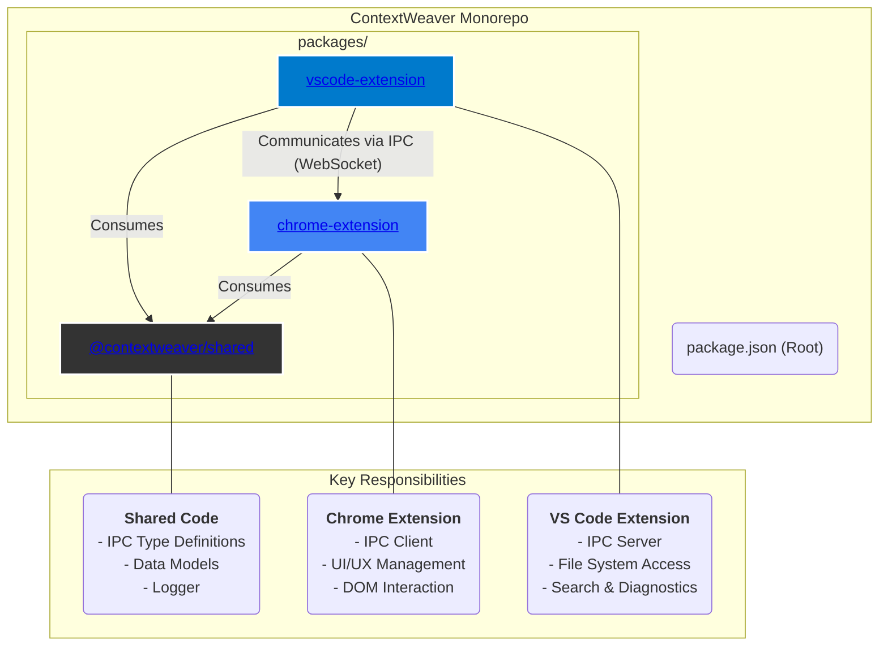
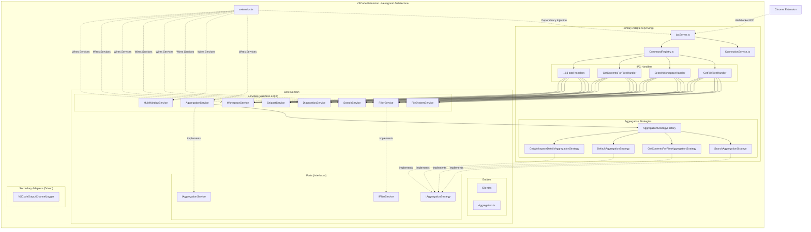
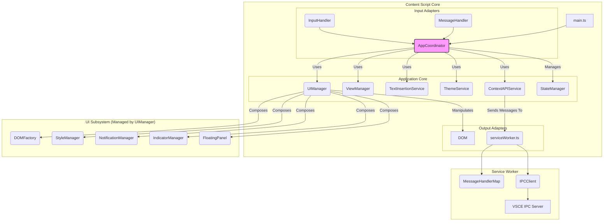

# ContextWeaver: System Architecture

## 1. Introduction

This document outlines the software architecture of the ContextWeaver system. It describes the major components, their responsibilities, interactions, and key design decisions. This document is intended to be a living document, updated as the system evolves.

The primary goal of the ContextWeaver is to provide users with a convenient and efficient way to add content and context from their VS Code projects directly into Large Language Model (LLM) chat interfaces.

Refer to the `SRS.md` for detailed functional and non-functional requirements.

## 2. Guiding Principles

The architecture adheres to principles of modern software engineering, including:
*   Separation of Concerns
*   Single Responsibility Principle (SRP)
*   KISS (Keep It Simple, Stupid)
*   DRY (Don't Repeat Yourself)
*   Security by Design
*   Maintainability and Testability

## 3. System Overview

The ContextWeaver consists of two main applications:

*   **VS Code Extension (VSCE):** Runs within Visual Studio Code, responsible for accessing project data, file system operations, and hosting the IPC server.
*   **Chrome Extension (CE):** Runs within the Google Chrome browser, responsible for the user interface, interacting with LLM web pages, and acting as the IPC client.

These components communicate via a local Inter-Plugin Communication (IPC) mechanism.

### 3.1. High-Level Package Architecture

ContextWeaver is developed within a single Git repository (monorepo) to facilitate management of shared code, ensure type safety across components, and streamline coordinated development. The architecture is composed of three primary packages.



*   **`packages/vscode-extension`**: This is the backend of the system, running inside VS Code. It is responsible for all interactions with the local development environment, including file system access, running searches, and collecting diagnostics. It hosts the WebSocket-based `IPCServer` that listens for requests from the Chrome extension.

*   **`packages/chrome-extension`**: This is the frontend, running in the user's browser. It is responsible for all user-facing UI, including the floating panel and context indicators. It detects user actions on LLM websites and communicates with the VS Code extension via its `IPCClient` to fetch data.

*   **`packages/shared`**: A critical internal library that contains code shared between the two extensions. Its primary purpose is to define the IPC contract through TypeScript interfaces (`ipc-types.ts`, `data-models.ts`), ensuring that both the client and server communicate using the same, type-safe structures.

## 4. Detailed Component Architecture

### 4.1. VS Code Extension (VSCE)

The VS Code Extension acts as the backend data provider for the system. Its architecture follows a **hexagonal (ports and adapters)** pattern, separating core application logic from infrastructure concerns.



*   **Responsibilities:**
    *   **Data Provider:** Accessing and providing file/folder structures, file content, and search results from the active VS Code workspace(s).
    *   **Filtering Logic:** Applying `.gitignore` rules or default filters to exclude irrelevant content.
    *   **IPC Server:** Hosting a local server (WebSocket) to listen for requests from the CE. Includes port fallback mechanism and message routing.
    *   **Snippet Handling:** Capturing selected code snippets and pushing them to the CE.
    *   **Workspace Management:** Handling multi-root workspaces and respecting VS Code's Workspace Trust feature.
    *   **Multi-Window Aggregation:** Coordinating requests and aggregating responses from multiple open VS Code windows.
*   **Key Modules:**
    *   **Core Domain (`src/core/`):**
        *   `entities/`: Core data structures (`Client.ts`, `Aggregation.ts`)
        *   `ports/`: Service interfaces defining contracts (`IAggregationService.ts`, `IAggregationStrategy.ts`, `IFilterService.ts`)
        *   `services/`: Pure business logic services:
            *   `AggregationService.ts`: Manages response aggregation sessions using strategy pattern
            *   `MultiWindowService.ts`: Handles primary/secondary window coordination
            *   `FileSystemService.ts`: Unified file system operations with single traversal method
            *   `FilterService.ts`: Manages `.gitignore` and default ignore patterns
            *   `SearchService.ts`, `DiagnosticsService.ts`, `SnippetService.ts`, `WorkspaceService.ts`
    *   **Primary Adapters (`src/adapters/primary/ipc/`):**
        *   `ipcServer.ts`: Thin coordinator delegating to services
        *   `ConnectionService.ts`: WebSocket server management and client connections
        *   `CommandRegistry.ts`: Routes IPC requests to appropriate handlers
        *   `handlers/`: 13 specific command handlers (e.g., `GetFileTreeHandler`, `SearchWorkspaceHandler`)
        *   `aggregation/`: Strategy pattern implementation:
            *   `AggregationStrategyFactory.ts`: Creates appropriate strategy for each command
            *   Various strategy classes for different aggregation types
    *   **Secondary Adapters (`src/adapters/secondary/logging/`):**
        *   `VSCodeOutputChannelLogger.ts`: VS Code-specific logging implementation
    *   **Entry Point:**
        *   `extension.ts`: Dependency injection container, wires all services together
*   **Technology Stack:**
    *   TypeScript
    *   VS Code API
    *   Node.js (runtime environment provided by VS Code)
    *   WebSocket library (`ws`)

### 4.2. Chrome Extension (CE)

The Chrome Extension is designed using a modular architecture that resembles the **Ports and Adapters** (or Hexagonal) pattern. This separates the core application logic from the services it interacts with, making the system more maintainable and testable.



*   **Responsibilities:**
    *   **User Interface (UI):** Rendering and managing the floating UI for context selection, displaying context block indicators, and handling user interactions.
    *   **LLM Page Interaction:** Detecting trigger characters (`@`) in chat inputs, inserting content, and managing the display of context indicators on supported LLM web pages.
    *   **IPC Client:** Connecting to the VSCE server, sending requests, and handling responses.
    *   **State Management:** Managing the state of active context blocks and duplicate content prevention.
*   **Key Modules:**
    *   `AppCoordinator.ts`: The central orchestrator (the "application core"). It initializes all other components and wires them together, handling the main application logic flow without being directly dependent on external technologies like the DOM or `chrome` APIs.
    *   `InputHandler.ts` & `MessageHandler.ts`: These are the primary **input adapters**. They listen for external events—user input from the DOM and messages from the service worker, respectively—and translate them into calls to the `AppCoordinator`.
    *   `UIManager.ts`: A **Facade** that simplifies interactions with the UI subsystem. It can be considered part of the UI **output adapter**. It abstracts away the complexity of managing individual UI components like the `FloatingPanel`, `IndicatorManager`, and `NotificationManager`.
    *   `ViewManager.ts`: Manages which view is currently displayed in the floating panel (e.g., general options, search results, browse view). It uses specific `renderer` modules to generate the content for each view.
    *   `StateManager.ts`: A centralized store for the content script's state, managed by the `AppCoordinator`.
    *   `ContextAPIService.ts`: An **output adapter** that provides a clean, async API for the `AppCoordinator` to request data from the backend. It abstracts the details of communicating with the service worker.
    *   `serviceWorker.ts`: The background process that manages the persistent WebSocket connection to the VSCE via its own `IPCClient`. It acts as the bridge between the content script and the VSCE, using a `MessageHandlerMap` to route requests.
*   **Technology Stack:**
    *   TypeScript/JavaScript
    *   Chrome Extension APIs (Content Scripts, Service Workers, Storage, etc.)
    *   HTML, CSS (for UI elements)
    *   WebSocket API (browser-native)

## 5. Inter-Plugin Communication (IPC)

*   **Mechanism:** WebSocket connection over `localhost`, with port fallback if the default port is in use.
*   **Protocol:** JSON-based messages. (Detailed message schemas are defined in the `docs/IPC_Protocol_Design.md` document).
*   **Authentication:** Removed. Relies on `localhost` binding for security.
*   **Key Data Flows:**
    *    CE requests project data (file tree, file content, folder content, search, directory listings) from VSCE.
    *   VSCE responds with data or error messages.
    *   VSCE pushes code snippets to CE.
    *   CE registers its active tab/context with VSCE for snippet targeting.

## 6. Data Model

The primary data structures, especially those used for Inter-Plugin Communication (IPC) and for representing core entities like context blocks, files, and search results, are formally defined as TypeScript interfaces within the `packages/shared/src/` directory.

Key data models include:
*   **`ContextBlockMetadata`**: Defined in `packages/shared/src/data-models.ts`. Describes the metadata for each block of content inserted into the LLM chat.
*   **`FileData`**: Defined in `packages/shared/src/data-models.ts`. Represents the content and properties of a single file.
*   **`SearchResult`**: Defined in `packages/shared/src/data-models.ts`. Structure for items returned by the workspace search.
*   **`DirectoryEntry`**: Defined in `packages/shared/src/data-models.ts`. Structure for items listed in a directory.
*   **IPC Payloads**: All request, response, and push message payloads are defined as interfaces in `packages/shared/src/ipc-types.ts`.

Refer to these TypeScript files for the authoritative definitions of these structures. The `docs/IPC_Protocol_Design.md` provides a human-readable overview that aims to mirror these type definitions.

## 7. Key Design Decisions & Rationale

*This section logs key architectural decisions using stable, sequential identifiers (e.g., `[D-001]`) for permanent referencing.*

*   **[D-001] Decision:** Chose WebSockets for IPC.
    *   **Rationale:** Allows for bidirectional communication, efficient for pushing snippets from VSCE to CE, and well-supported in both Node.js (VSCE) and browser environments (CE).
*   **[D-002] Decision:** Root `.gitignore` only for V1.
    *   **Rationale:** Simplifies initial implementation complexity, aligning with SRS 1.2. Future versions may support subdirectory `.gitignore` files.
*   **[D-003] Decision:** Adopt a monorepo structure.
    *   **Rationale:** Simplifies management of shared code (e.g., IPC type definitions), versioning, and coordinated development and issue tracking between the VS Code Extension and Chrome Extension components.
*   **[D-004] Decision:** Removed token-based authentication for IPC.
    *   **Rationale:** Simplified user setup and reduced friction. Security relies on the VSCE server binding exclusively to `localhost`, mitigating external access risks. The risk from other local malicious software was deemed acceptable for V1 given the nature of data exchanged.
*   **[D-005] Decision:** Use `chrome.tabs.sendMessage` to broadcast `push_snippet` messages from the CE Service Worker to all matching Content Scripts.
    *   **Rationale:** Resolved "Receiving end does not exist" errors by actively querying for all supported LLM tabs and sending the message to each one. This broadcast approach is more robust than relying on a single `targetTabId` and aligns with the multi-window architecture where a snippet from any VS Code window should be available to any active LLM tab.
*   **[D-006] Decision:** Introduced a `packages/shared/src` module for defining common TypeScript types for IPC and data models.
    *   **Rationale:** To enforce type safety, ensure consistency between the Chrome Extension (CE) and VS Code Extension (VSCE), improve maintainability, and adhere to DRY (Don't Repeat Yourself) principles for the IPC contract. This makes the communication protocol explicit and verifiable at compile-time.
*   **[D-007] Decision:** Refactored the main Chrome Extension content script into a modular architecture using an `AppCoordinator` and specialized services/handlers.
    *   **Rationale:** To improve separation of concerns, reduce the complexity of a single file, enhance readability, maintainability, and testability, adhering to the Single Responsibility Principle (SRP).
*   **[D-008] Decision:** Implemented a Primary/Secondary Architecture for multi-window support.
    *   **Rationale:** To provide robust multi-window support for VS Code, enabling the Chrome Extension to aggregate data from multiple VS Code instances. This design centralizes coordination in a primary VSCE instance through leader election. The primary forwards requests to secondary instances and aggregates responses, simplifying client-side logic while ensuring data consistency across windows.
*   **[D-009] Decision:** Implemented client-side tree building for the "Browse" view.
    *   **Rationale:** To offload view-specific logic from the VS Code Extension to the Chrome Extension. The VSCE provides a flat, recursive list of directory entries, and the CE constructs the hierarchical tree view. This makes the backend API simpler and more generic, reduces IPC payload complexity, and allows for more flexible rendering on the client side.
*   **[D-010] Decision:** Adopted SVG icons with CSS masking for UI elements.
    *   **Rationale:** To achieve high-quality, scalable, and theme-aware icons without relying on external font libraries. SVG assets combined with CSS `mask-image` and `background-color` allow for dynamic coloring based on the UI theme (light/dark mode) using a single set of assets.

## 8. Security Considerations

*   IPC server in VSCE binds only to `localhost`.
*   IPC authentication via shared secret token has been removed. Security relies on `localhost` binding.
*   VSCE respects Workspace Trust.
*   CE content scripts operate with necessary but minimal permissions.

## 9. Future Architectural Considerations

*   More sophisticated IPC discovery (beyond fixed port range).
*   Potential for abstracting data providers in VSCE if other IDEs were to be supported (highly speculative).
*   Enhanced diagnostics aggregation across multiple workspace folders.

---

## Appendix A: Monorepo File Structure

For those needing a complete file-by-file view, the following structure is provided.

<details>
<summary>Click to expand the full file tree</summary>

*Note: This file tree reflects the current state of the repository and may differ from older architectural diagrams.*

```
.
├── docs
│   ├── ARCHITECTURE.md
│   ├── IPC_Protocol_Design.md
│   ├── REFACTORING_PLAN.md
│   ├── SRS.md
│   └── TROUBLESHOOTING_AND_LESSONS_LEARNED.md
├── packages
│   ├── chrome-extension
│   │   ├── .eslintrc.json
│   │   ├── jest.config.js
│   │   ├── manifest.json
│   │   ├── package.json
│   │   ├── popup.html
│   │   ├── assets
│   │   │   ├── fonts
│   │   │   │   └── MaterialSymbols-Variable.woff2
│   │   │   └── icons
│   │   │       ├── arrow_back.svg
│   │   │       ├── check_box.svg
│   │   │       ├── check_box_outline_blank.svg
│   │   │       ├── close.svg
│   │   │       ├── content_copy.svg
│   │   │       ├── description.svg
│   │   │       ├── docs_add_on.svg
│   │   │       ├── folder.svg
│   │   │       ├── folder_open.svg
│   │   │       ├── info.svg
│   │   │       ├── package_2.svg
│   │   │       ├── search.svg
│   │   │       └── warning_amber.svg
│   │   ├── images
│   │   │   ├── icon128.png
│   │   │   ├── icon16.png
│   │   │   └── icon48.png
│   │   ├── src
│   │   │   ├── ceLogger.ts
│   │   │   ├── contentScript.ts
│   │   │   ├── popup.ts
│   │   │   ├── serviceWorker.ts
│   │   │   ├── serviceWorkerClient.ts
│   │   │   ├── uiManager.ts
│   │   │   ├── serviceWorker
│   │   │   │   ├── handlers
│   │   │   │   │   ├── GetActiveFileInfoHandler.ts
│   │   │   │   │   ├── GetContentsForSelectedOpenFilesHandler.ts
│   │   │   │   │   ├── GetEntireCodebaseHandler.ts
│   │   │   │   │   ├── GetFileContentHandler.ts
│   │   │   │   │   ├── GetFileTreeHandler.ts
│   │   │   │   │   ├── GetFolderContentHandler.ts
│   │   │   │   │   ├── GetOpenFilesHandler.ts
│   │   │   │   │   ├── GetWorkspaceDetailsHandler.ts
│   │   │   │   │   ├── GetWorkspaceProblemsHandler.ts
│   │   │   │   │   ├── IMessageHandler.ts
│   │   │   │   │   ├── index.ts
│   │   │   │   │   ├── ListFolderContentsHandler.ts
│   │   │   │   │   ├── MessageHandlerMap.ts
│   │   │   │   │   ├── PushSnippetHandler.ts
│   │   │   │   │   └── SearchWorkspaceHandler.ts
│   │   │   │   ├── ports
│   │   │   │   │   └── IpcClient.ts
│   │   │   │   └── ipcClient.ts
│   │   │   └── ui
│   │   │       ├── AppCoordinator.ts
│   │   │       ├── main.ts
│   │   │       ├── stateManager.ts
│   │   │       ├── components
│   │   │       │   ├── DOMFactory.ts
│   │   │       │   ├── FloatingPanel.ts
│   │   │       │   ├── IndicatorManager.ts
│   │   │       │   ├── NotificationManager.ts
│   │   │       │   └── StyleManager.ts
│   │   │       ├── handlers
│   │   │       │   ├── ActionHandler.ts
│   │   │       │   ├── InputHandler.ts
│   │   │       │   └── MessageHandler.ts
│   │   │       ├── ports
│   │   │       │   ├── IDomFactory.ts
│   │   │       │   ├── IFloatingPanel.ts
│   │   │       │   ├── IIndicatorManager.ts
│   │   │       │   ├── INotificationManager.ts
│   │   │       │   └── IStyleManager.ts
│   │   │       ├── services
│   │   │       │   ├── ContextAPIService.ts
│   │   │       │   ├── TextInsertionService.ts
│   │   │       │   └── ThemeService.ts
│   │   │       ├── utils
│   │   │       │   ├── domUtils.ts
│   │   │       │   └── formatters.ts
│   │   │       └── view
│   │   │           ├── ViewManager.ts
│   │   │           └── renderers
│   │   │               ├── browseRenderer.ts
│   │   │               ├── openFilesRenderer.ts
│   │   │               ├── optionsRenderer.ts
│   │   │               └── searchRenderer.ts
│   │   ├── tests
│   │   │   ├── contentScript.test.ts
│   │   │   └── setup.js
│   │   └── tsconfig.json
│   ├── shared
│   │   ├── package.json
│   │   ├── src
│   │   │   ├── data-models.ts
│   │   │   ├── error-types.ts
│   │   │   ├── index.ts
│   │   │   ├── ipc-types.ts
│   │   │   └── logger.ts
│   │   └── tsconfig.json
│   └── vscode-extension
│       ├── .eslintrc.json
│       ├── .vscodeignore
│       ├── jest.config.js
│       ├── package.json
│       ├── src
│       │   ├── adapters
│       │   │   ├── primary
│       │   │   │   └── ipc
│       │   │   │       ├── CommandRegistry.ts
│       │   │   │       ├── ConnectionService.ts
│       │   │   │       ├── ICommandHandler.ts
│       │   │   │       ├── ipcServer.ts
│       │   │   │       ├── types.ts
│       │   │   │       ├── aggregation
│       │   │   │       │   ├── AggregationStrategyFactory.ts
│       │   │   │       │   ├── DefaultAggregationStrategy.ts
│       │   │   │       │   ├── GetContentsForFilesAggregationStrategy.ts
│       │   │   │       │   ├── GetOpenFilesAggregationStrategy.ts
│       │   │   │       │   ├── GetWorkspaceDetailsAggregationStrategy.ts
│       │   │   │       │   └── SearchAggregationStrategy.ts
│       │   │   │       └── handlers
│       │   │   │           ├── GetActiveFileInfoHandler.ts
│       │   │   │           ├── GetContentsForFilesHandler.ts
│       │   │   │           ├── GetEntireCodebaseHandler.ts
│       │   │   │           ├── GetFileContentHandler.ts
│       │   │   │           ├── GetFileTreeHandler.ts
│       │   │   │           ├── GetFilterInfoHandler.ts
│       │   │   │           ├── GetFolderContentHandler.ts
│       │   │   │           ├── GetOpenFilesHandler.ts
│       │   │   │           ├── GetWorkspaceDetailsHandler.ts
│       │   │   │           ├── GetWorkspaceProblemsHandler.ts
│       │   │   │           ├── ListFolderContentsHandler.ts
│       │   │   │           ├── RegisterActiveTargetHandler.ts
│       │   │   │           └── SearchWorkspaceHandler.ts
│       │   │   └── secondary
│       │   │       └── logging
│       │   │           └── VSCodeOutputChannelLogger.ts
│       │   ├── core
│       │   │   ├── entities
│       │   │   │   ├── Aggregation.ts
│       │   │   │   └── Client.ts
│       │   │   ├── ports
│       │   │   │   ├── IAggregationService.ts
│       │   │   │   ├── IAggregationStrategy.ts
│       │   │   │   └── IFilterService.ts
│       │   │   └── services
│       │   │       ├── AggregationService.ts
│       │   │       ├── DiagnosticsService.ts
│       │   │       ├── FileSystemService.ts
│       │   │       ├── FilterService.ts
│       │   │       ├── MultiWindowService.ts
│       │   │       ├── SearchService.ts
│       │   │       ├── SnippetService.ts
│       │   │       └── WorkspaceService.ts
│       │   └── extension.ts
│       ├── tests
│       │   └── unit
│       │       ├── AggregationService.test.ts
│       │       ├── fileSystemService.test.ts
│       │       ├── FilterService.test.ts
│       │       └── ipcServer.test.ts
│       └── tsconfig.json
├── package.json
└── README.md
```

</details>

---
*This document should be updated by the development assistant whenever significant architectural changes are made, new components are added, or key design decisions are finalized.*